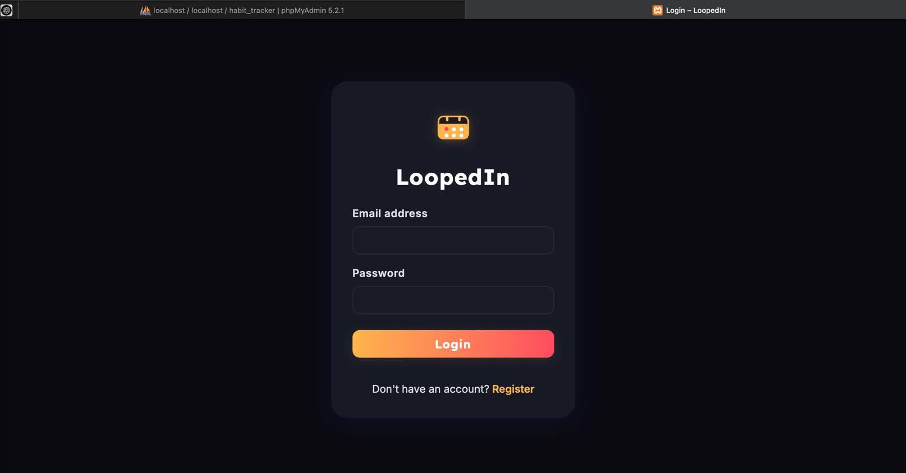
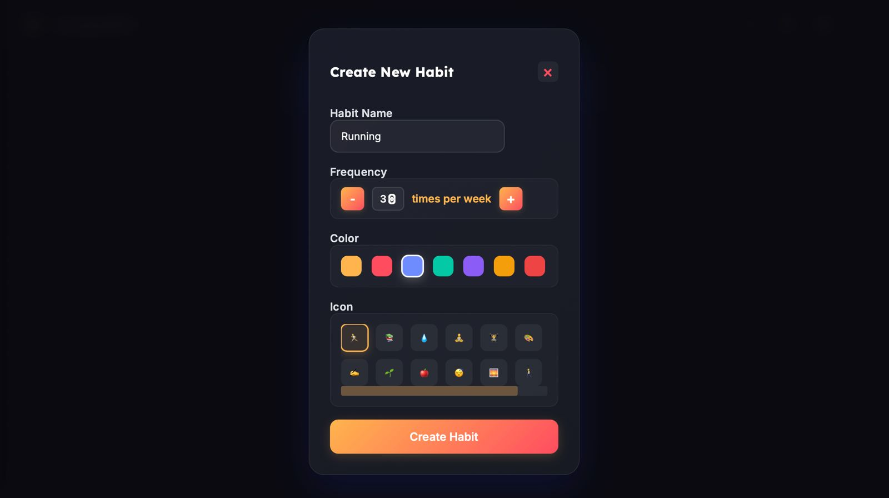
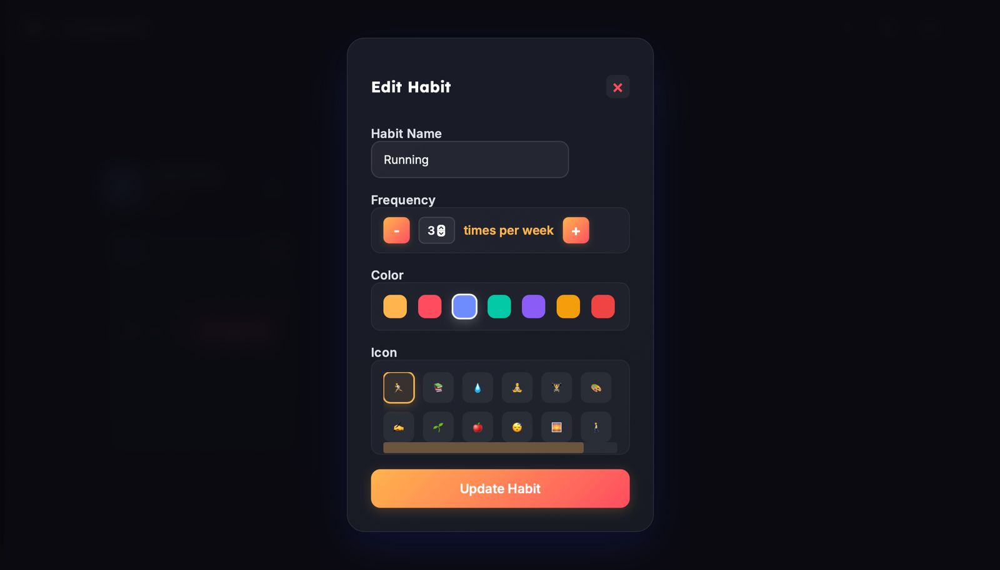
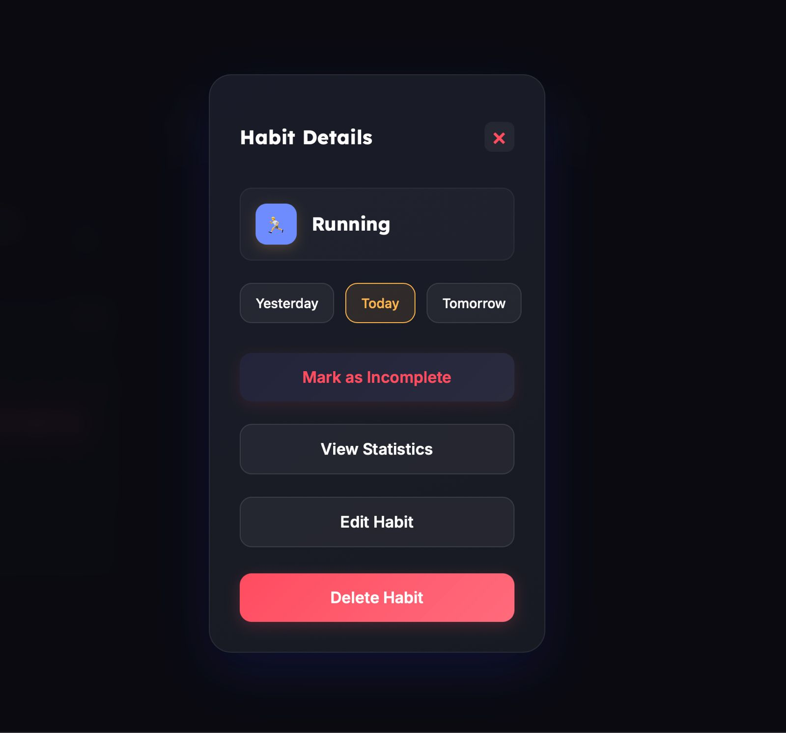
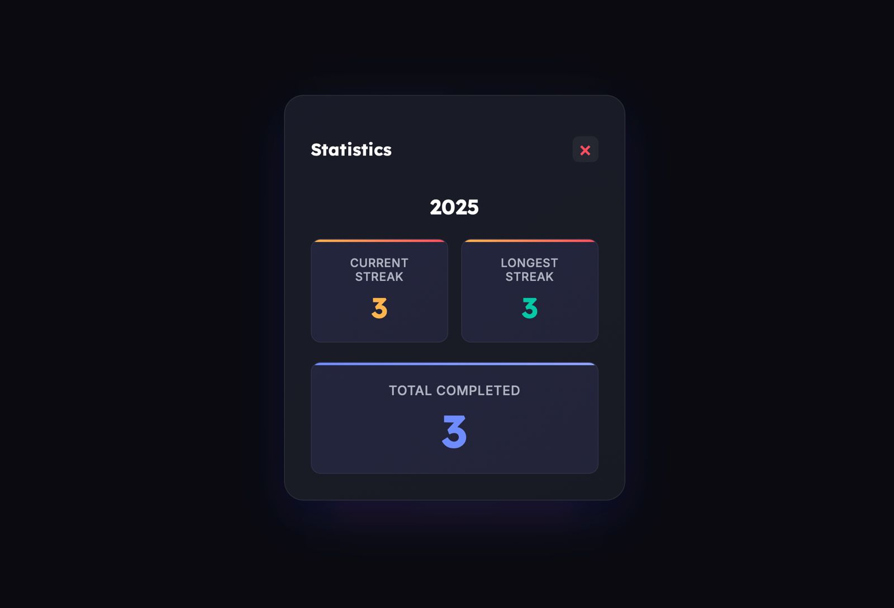

# LoopedIn WebApp

LoopedIn is a PHP-based habit tracker app built for academic projects and personal productivity enhancement.

---

## 📌 Features

- 🔐 User authentication (Register/Login/Logout)
- ✅ Daily habit check-in calendar
- 📊 Track streaks and performance
- 📁 Modular folder structure

---

## 🛠 Technologies Used

- PHP
- MySQL (XAMPP)
- HTML5 / CSS3
- JavaScript (vanilla)
- Git & GitHub for version control

---

## 🎥 Demo Video

[▶️ Watch Demo](assets/github.mp4)

> Click the link above to watch a walkthrough video of the LoopedIn WebApp and see all its features in action.

---

## 📸 Screenshots

### 🔐 Login Page


### 🏠 Dashboard


### ➕ Create New Habit


### 📝 Edit Habit


### ❌ Delete Habit


### 📌 Notes Section


### 📈 Stats View


---


## 🚀 Setup Instructions

1. Clone this repo:
   ```bash
   git clone https://github.com/eziofire/-loopedin-webapp.git
2.	Copy files to your XAMPP htdocs/ directory
3.	Import the SQL file to phpMyAdmin
4.	Run on localhost/loopedin-webapp

